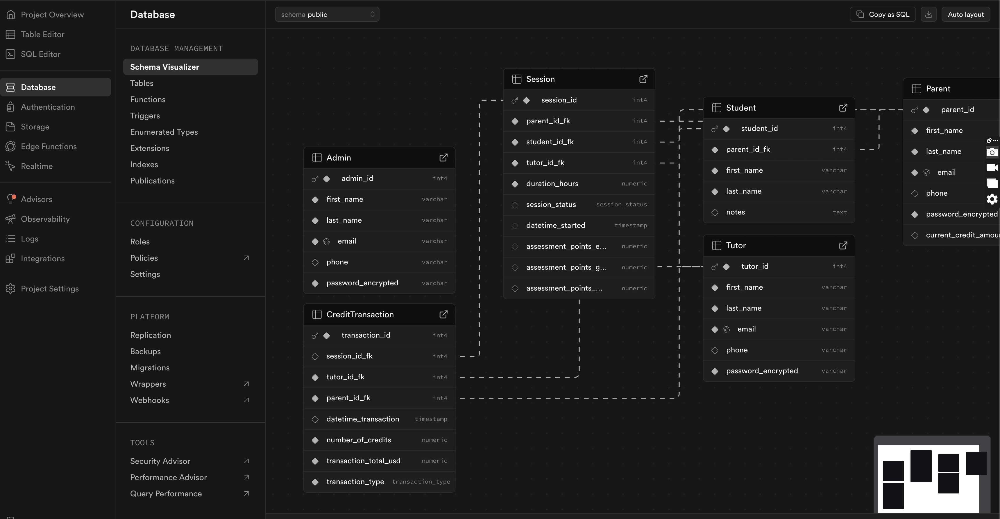

# back-end

Tutortoise service is back end service created to support the Tutortoise application. It is responsible for handling all the business logic, data storage, and communication with external services and Tutortoise GUI.

### Git

`git clone https://github.com/DSD-Cohort-Spring-2026-Tutor-Manager/back-end.git`

### Technologies Used
- **Java**: The primary programming language used for developing the back-end service.
- **Spring Boot**: A framework for building Java applications, providing features like dependency injection, security, and RESTful API development.
- **Supabase**: A relational database management system used for storing application data with free tiers available for development and testing.
- **Maven**: A build automation tool used for managing project dependencies and building the application.
- **JUnit**: A testing framework for Java, used for writing and running unit tests.

### Database
#### Access the dashboard online
- Go to [Supabase](https://supabase.com/dashboard/project/imncabasndcwkaxvvkbo) and log in with your credentials.
- 

#### Access the database locally
- If you are using IntelliJ or VSCode, you can use the database tools to connect to the Supabase database using the connection string below
**`jdbc:postgresql://aws-1-us-east-1.pooler.supabase.com:5432/postgres?user=postgres.imncabasndcwkaxvvkbo&password=[Password]`**
- db-1.sql is the SQL file that contains the table creation. You can run this file locally and not in supabase to create tables provided you drop them first.
- db-2.sql is the SQL file that contains the data insertion for Admin, Parent and Tutor.
- db-3.sql is the SQL file that contains the data insertion for Student, Session and CreditTransaction.

